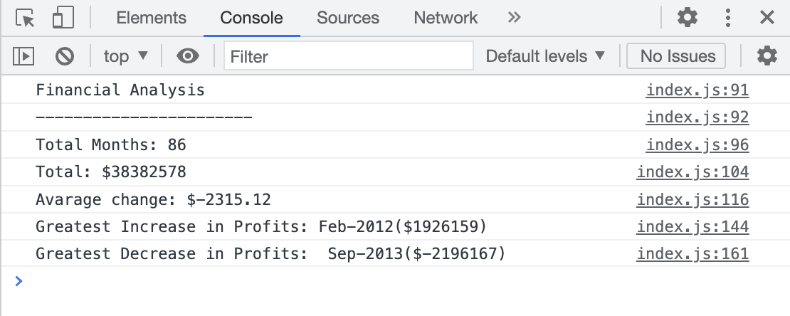

# Console Finance Tool

## Description

The Console Finance Tool presents analysis of the previously given financial records of a company. Available dataset was composed of Date and Profit/Losses data. The tool is enable to show the total months included in dataset, the net total amount of Profit/Losses over the entire period, the average of the changes in Profit/Losses over the entire period. It also defines the greatest increase in profits and the greatest decrease in losses over the entire period.

[Console Finance Tool](https://mrsannanoga.github.io/Console-Finances/) is live and enable to view online. 

## Usage

To see the Console Finance Tool you have to open abovementioned webpage in the browser and inspect it by clicking option+command+i on Mac devices. Then find "console" to check the tool's results. The screenshot below shows how it looks. 

 

## Licence

None
